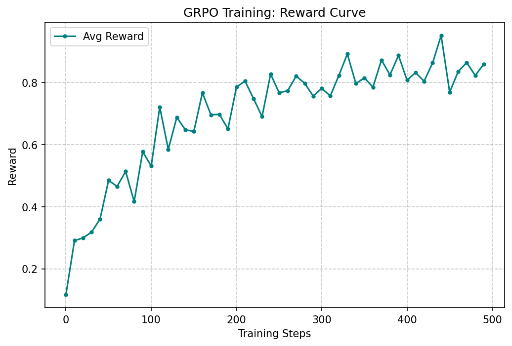
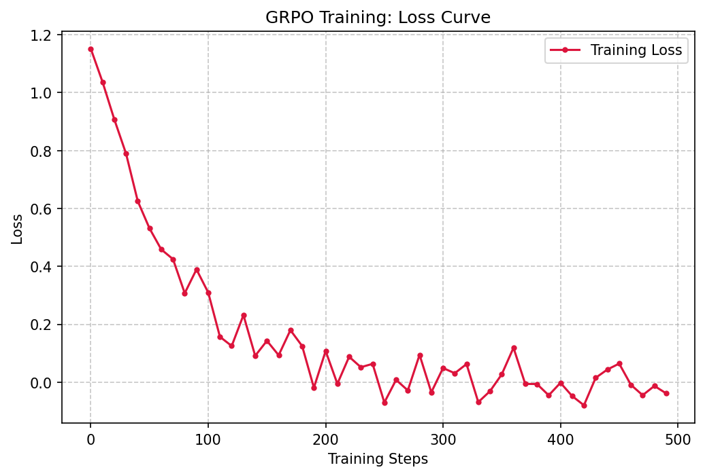

# 🌍 EcoGrid OpenEnv

**Production-grade Reinforcement Learning environment and API for sustainable grid control.**



## 📖 1. Problem Motivation

The transition to renewable energy is the defining engineering challenge of our generation. However, it introduces a massive new problem for power grids: **volatility**.
The sun doesn't always shine, and the wind doesn't always blow. Yet, when a hospital needs power or a million commuters plug in their EVs at 6 PM, the grid must deliver immediately. If supply doesn't perfectly match demand, the frequency drops, and rolling blackouts begin.

Currently, human operators manage this by spinning up expensive, carbon-heavy fossil fuel "peaker plants" to cover the gaps. 

**Our Solution**: **EcoGrid OpenEnv** places an AI agent in the control room. We train agents using Group Relative Policy Optimization (GRPO) to balance renewable energy, fossil fuels, and battery storage to meet demand while minimising cost and adhering to a strict carbon cap.

---

## 🔗 2. Important Links & External Content

- **Hugging Face Space (Interactive Demo)**: [EcoGrid on HF Spaces](https://huggingface.co/spaces/Loosebag/EcoGrid)
- **Blog Post**: [Read our 2-minute Hackathon Pitch](BLOG.md)
- **Colab Training**: Open `colab_training.ipynb` in Google Colab to fine-tune your own Qwen-based agent.

---

## ⚙️ 3. What The Agent Controls

At each step the agent observes the demand, weather forecasts, battery state, and carbon budget, and then picks:
- `renewable_ratio` in `[0, 1]`
- `fossil_ratio` in `[0, 1]`
- `battery_action` in `[-1, 1]` (negative to discharge, positive to charge)

**Safety Constraint**: `renewable_ratio + fossil_ratio <= 1.0` (enforced with normalization guards).

---

## 🚀 4. Demo Instructions

You can run EcoGrid in two modes:

### Dashboard Mode (Hugging Face Deployment)
Start the interactive UI where you can watch random, heuristic, and trained agents battle the grid volatility in real-time.
```bash
# Ensure dependencies are installed
uv sync --frozen --no-dev
streamlit run app.py
```

### API Mode (Headless / Service)
Run the OpenEnv-compliant HTTP server.
```bash
python -m server.app
```

### Run Smoke Tests
Ensure the API is healthy:
```bash
python scripts/smoke_api.py --base-url http://127.0.0.1:7860
```

---

## 📊 5. Proof of Training & Results

We used **Unsloth** and **TRL** to train a quantized Large Language Model (Qwen2.5) using GRPO. The agent learns entirely from the environment's deterministic reward function.

**Weights & Biases (W&B)** integration is included in `train_unsloth.py` to seamlessly track experiments. 



### Reproducible Benchmarks
Run our benchmark script to compare agent heuristics:
```bash
python scripts/benchmark.py --seeds 1,2,3,4,5 --out logs/benchmark_results.json
```
**Current Post-Fix Means (5 seeds)**:
- **Easy**: random `0.2721`, heuristic `0.7595`
- **Medium**: random `0.2545`, heuristic `0.7847`
- **Hard**: random `0.0010`, heuristic `0.4000`

---

## 💻 6. Installation & Deployment

### Runtime Only
```bash
pip install -r requirements.txt
```

### Training Stack (includes W&B, Unsloth, TRL)
```bash
pip install -r requirements-train.txt
```

### Hugging Face Space Deployment
We utilize `uv.lock` for lightning-fast and deterministic Hugging Face Docker deployments.
```bash
# Regenerate lock file
uv lock

# Build Docker image locally to test
docker build -t ecogrid .
docker run -p 7860:7860 ecogrid
```

*Built by Team DD.*
